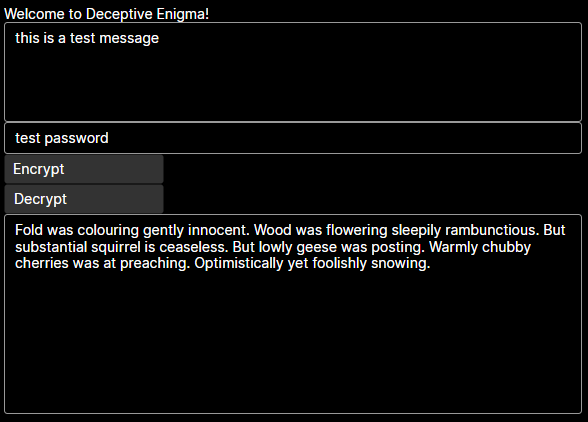

Disclaimer: this is a recreational program, not meant for actual secrets
# deceptive enigma
A recreational program that "encrypts" messages into readable sentences, 
which can, of course, be decrypted back. One letter in the orignal message maps to
one word in the encrypted message.

## Improvements for future
 - [ ] Better handling / limits for long messages
 - [ ] Robust error reporting and management
 - [ ] ML trained language model for more natural encrypted messages

## Run
- install `.NET 6.0`
- run `dotnet run` from `Src` directory

## Debugging in vscode
- install `C#` extension
- in extension settings check use omnisharp

## Using
- `.NET 6`
- `Avalonia UI` avalonia.app template
